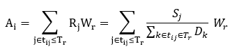
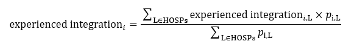
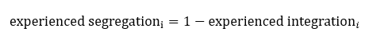
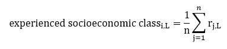
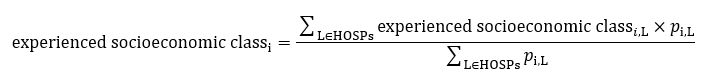

# METHODS

This document provides methodological details for the computation of the Nth Nearest Hospital Index (NNHI), hospital accessibility (E2SFCA), the experienced segregation (ES) and experienced socioeconomic class (ESC) indices, and the discrete choice model used to characterize hospital choice behavior.

---

## 1. Nth Nearest Hospital Index (NNHI)

The Nth Nearest Hospital Index (NNHI) was used to characterize hospital bypass behaviour. NNHI measures how far down the ordered list of nearby hospitals a patient chooses to visit.

To compute NNHI for each patient:

Calculate the road network distance from the patient’s residence to all hospitals in the city.

Sort these distances in ascending order.

Identify the rank of the hospital actually visited.

Record this rank as the NNHI value.

Interpretation:

NNHI = 1: The patient visited the nearest hospital (no bypass behaviour).

NNHI > 1: The patient bypassed closer hospitals and chose a more distant one.

For example, NNHI = 5 indicates that the patient selected the fifth nearest hospital.

This metric provides a simple, interpretable indicator of patients' preferences or constraints that lead them to bypass nearby facilities.

---

## 2. Hospital Accessibility (E2SFCA)

Hospital accessibility was evaluated using the Enhanced Two-Step Floating Catchment Area (E2SFCA) method. The accessibility score for demand location i, denoted as $A_i$, is defined as:

where:

$R_j$ is the supply-to-demand ratio at hospital $j$

$t_{ij}$ is the shortest travel time between demand point $i$ and hospital $j$

$W_r$ is the distance-decay weight corresponding to travel-time zone $r$

Supply ($S_j$) is measured by hospital bed capacity

Demand ($D_k$) is measured by the population size at demand location $k$

Travel-time thresholds of 15, 30, and 60 minutes were adopted based on the “Golden Hour” principle as well as extensive prior research on healthcare accessibility.

Distance-decay weights $W_r$ were derived from a Gaussian decay function:

with $\beta = 440$.

Shortest-path travel times were calculated using OpenStreetMap road network data combined with Chinese urban road design specifications.

---

## 3. Experienced Segregation Index Within Hospitals

The experienced segregation (ES) index was used to assess how hospital bypass behaviour affects socioeconomic mixing within hospitals. The ES framework follows prior work by Abbiasov and Xu, and quantifies how frequently patients from different economic strata encounter one another during hospital visits.

### 4.1. Income Rank Assignment

Each city was divided into 200 m × 200 m residential grid units. Units were ranked into deciles based on their average residential property value. The decile rank was then assigned to all patients residing in that grid, serving as the proxy for each individual's income rank.

### 4.2. Experienced Integration at the Hospital Level

For individuals from residential unit i visiting hospital L, we quantified their level of socioeconomic integration with all other units visiting the same hospital.

where:

r_{j,L} = income rank of individuals from unit j who visit hospital L

n = number of residential units represented among patients visiting hospital L

This value measures the average socioeconomic distance between unit i and all other units accessing hospital L.

### 4.3. Aggregating to the Residential Unit Level

Experienced integration at the residential-unit level is obtained by aggregating over all hospitals accessed by individuals from unit i:

where:

p_{i,L} = number of individuals from unit i visiting hospital L

HOSPs = set of all hospitals within the city

This weighted average accounts for the distribution of patients from unit i across different hospitals.

### 4.4. Experienced Segregation

Experienced segregation is defined as:

Higher values indicate greater socioeconomic isolation during hospital visits.

### 4.5. Experienced Socioeconomic Class (ESC)

To evaluate whether a hospital disproportionately serves high- or low-income communities, we computed an experienced socioeconomic class (ESC) index.

### 4.5.1. ESC at the Hospital Level

For individuals from unit i accessing hospital L, the ESC score is defined as the average income rank of all patient origins visiting hospital L:

where:

r_{j,L} = income rank of individuals from unit j who visit hospital L

n = number of residential units represented among patients visiting hospital L

This value measures the average socioeconomic distance between unit i and all other units accessing hospital L.

### 4.5.2. Aggregating to the Unit Level

Unit-level ESC was computed by weighting hospital-level ESC values by visit counts:

where again p_{i,L} is the number of individuals from unit i accessing hospital L.

### 4.6. Rescaling

Both ES and ESC were rescaled to a 0–10 range, where:

10 represents the highest level of segregation or socioeconomic status

0 represents the lowest

This normalization facilitates interpretation and comparison across cities.

---

## 4. Discrete Choice Model

A mixed logit discrete choice model was used to evaluate how patients trade off hospital quality against travel distance when selecting a healthcare facility. To accommodate preference heterogeneity, coefficients were specified as random variables, allowing estimation of both mean preferences and standard deviations across the population.

### 4.1. Utility specification

The utility that patient i obtains from choosing hospital j is defined as:

where:

G_j = hospital grade (e.g., Tertiary Grade A, Secondary hospital)

B_j = hospital bed capacity (in hundreds)

R_j = Fudan Chinese Hospital ranking

D_{ij} = travel distance from patient i to hospital j (in 100 km units)

ε_{ij} = error term following a Type I extreme value distribution

The cubic distance specification allows for flexible, non-linear distance decay in hospital choice. The error term \(\varepsilon_{ij}\) is assumed to follow a Type I extreme value distribution.

To capture preference heterogeneity across patients, coefficients are allowed to vary randomly in the population (mixed logit specification), and both mean preferences and standard deviations are estimated.

Given computational constraints, the model is estimated via maximum simulated likelihood using an 8% random sample of patients. We estimate both pooled models and SES-stratified models to investigate systematic preference differences across socioeconomic groups.

### 4.2. Willingness to travel (WTT)

Willingness to travel (WTT) quantifies the additional distance a patient is willing to travel to obtain a one-unit improvement in hospital quality (e.g., upgrading from a secondary hospital to a tertiary hospital). WTT is defined as the marginal rate of substitution between distance and a quality attribute.

For percentile values of the observed distance distribution, WTT is computed as:

where:

β_Q ∈ {β_G, β_B, β_R} = marginal utility of a quality attribute (grade, beds, or ranking)

D_perc = empirical travel distance percentile (evaluated at 5% intervals)

This measure indicates how much additional travel burden patients accept in exchange for higher hospital quality.

---
